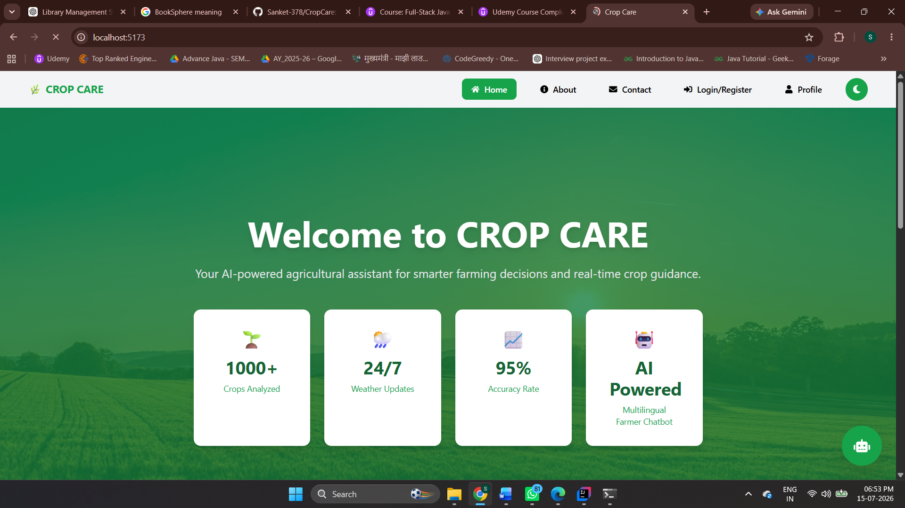
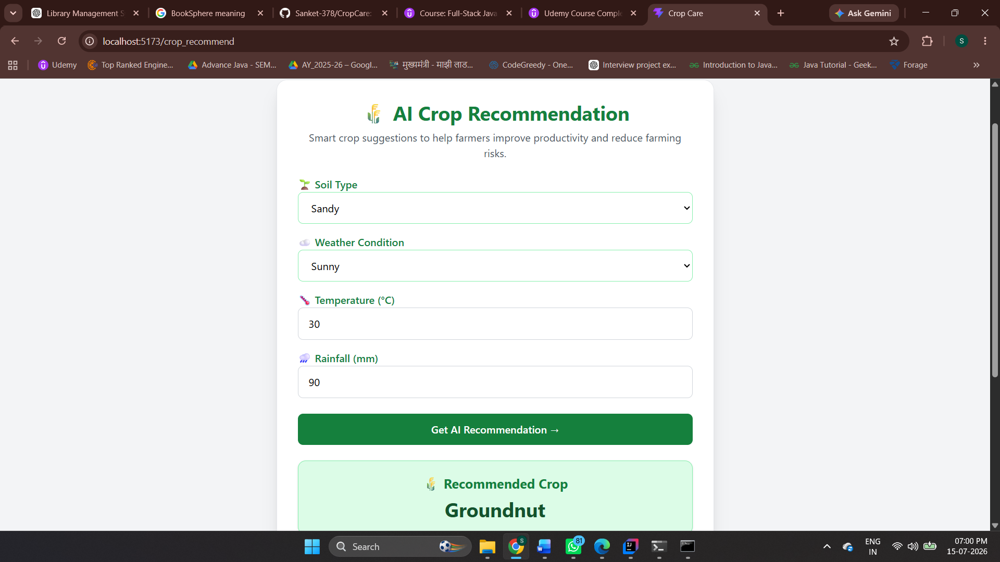
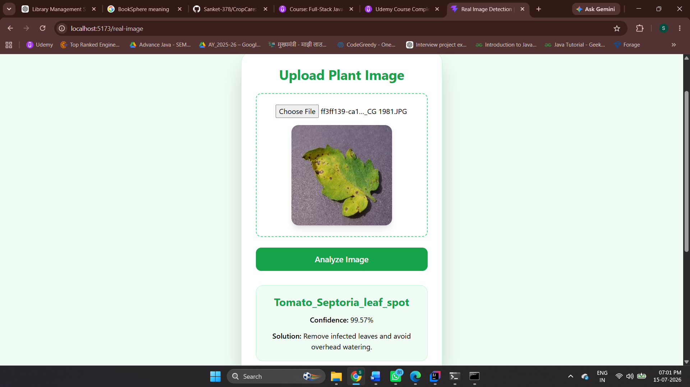
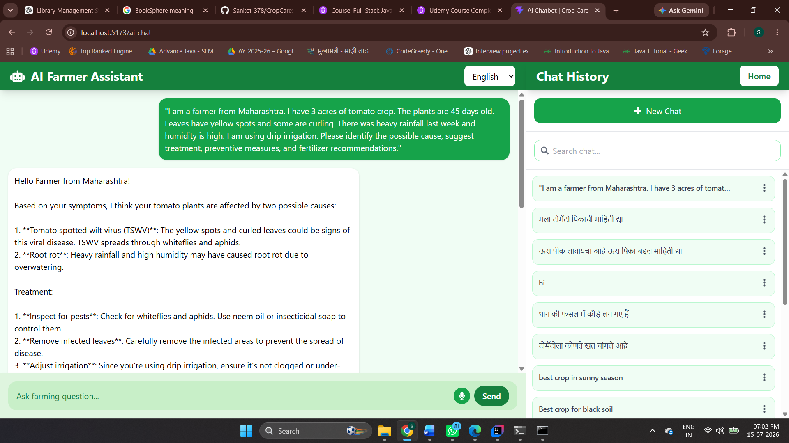
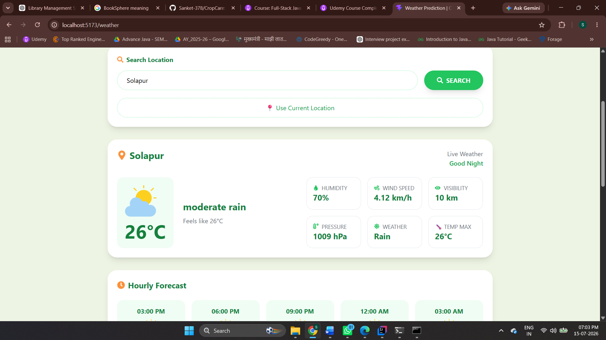

# 🌱 CropCare – AI-Powered Smart Agriculture Platform

CropCare is a full-stack smart agriculture platform developed to help farmers make better farming decisions using Artificial Intelligence, Machine Learning, and real-time weather information.

The platform provides crop recommendations based on soil and weather conditions, detects plant diseases from uploaded images, and includes an AI-powered Farmer Assistant to answer agriculture-related questions.

---

## 🚀 Features

- 🌾 Crop Recommendation based on soil type, temperature, rainfall, and weather conditions.
- 🍃 Plant Disease Detection using a Machine Learning model.
- 🤖 AI Farmer Assistant powered by the Groq API for agriculture-related guidance.
- 🌦️ Real-time Weather Information using the OpenWeather API.
- 🔐 User Authentication with Spring Security.
- 📱 Responsive user interface built using React.js and Tailwind CSS.
- 💾 MySQL database integration for storing user and application data.
- 🔗 RESTful APIs for seamless frontend and backend communication.

---

## 🛠️ Tech Stack

### Frontend
- React.js
- Tailwind CSS
- JavaScript
- HTML5
- CSS3

### Backend
- Java
- Spring Boot
- Spring MVC
- Spring Data JPA
- Hibernate
- Spring Security

### Database
- MySQL

### AI & APIs
- Groq API
- OpenWeather API
- Machine Learning Model

### Tools
- Git
- GitHub
- Maven
- IntelliJ IDEA

---

## 📂 Project Structure

```
CropCare
│
├── frontend          # React Frontend
├── src               # Spring Boot Backend
├── dl-model          # Machine Learning Models
├── pom.xml
├── README.md
└── ...
```

---

## ⚙️ Modules

### 🌾 Crop Recommendation
Recommends suitable crops based on:
- Soil Type
- Temperature
- Rainfall
- Weather Conditions

---

### 🍃 Disease Detection
- Upload plant leaf images.
- Detect plant diseases using a trained Machine Learning model.
- Display disease information and treatment recommendations.

---

### 🤖 AI Farmer Assistant
- Ask agriculture-related questions.
- Receive intelligent responses powered by the Groq API.
- Supports multilingual interaction.

---

### 🌦️ Weather Module
- Fetches live weather data using the OpenWeather API.
- Displays temperature and weather conditions to assist farmers.

---

### 👤 Authentication
- User Registration
- User Login
- Secure authentication using Spring Security.

---

## 🏗️ Architecture

```
React Frontend
       │
       ▼
REST APIs
       │
       ▼
Spring Boot
(Controller → Service → Repository)
       │
       ▼
Spring Data JPA / Hibernate
       │
       ▼
MySQL Database
```

---

## ▶️ How to Run

### Backend

```bash
git clone https://github.com/Sanket-378/CropCare.git

cd CropCare

mvn spring-boot:run
```

---

### Frontend

```bash
cd frontend

npm install

npm run dev
```

---

## 📸 Screenshots

> Add screenshots of:

- Home Page
- Crop Recommendation
- Disease Detection
- AI Farmer Assistant
- Weather Module

---

## 📌 Future Enhancements

- Voice-enabled AI Assistant
- Market Price Prediction
- Fertilizer Recommendation
- Mobile Application
- Multi-language Support
- Farmer Community Portal

---

## 👨‍💻 Developer

**Sanket Khatkale**

GitHub: https://github.com/Sanket-378

LinkedIn: https://www.linkedin.com/in/sanket-khatkale-9459122b0?utm_source=share&utm_campaign=share_via&utm_content=profile&utm_medium=android_app

---

## ⭐ If you like this project

Give this repository a ⭐ on GitHub.
